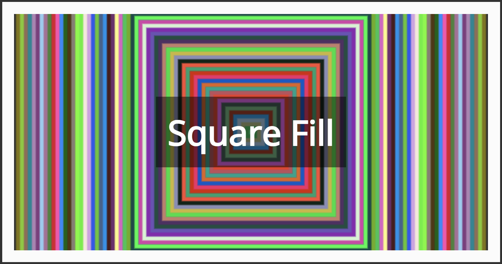
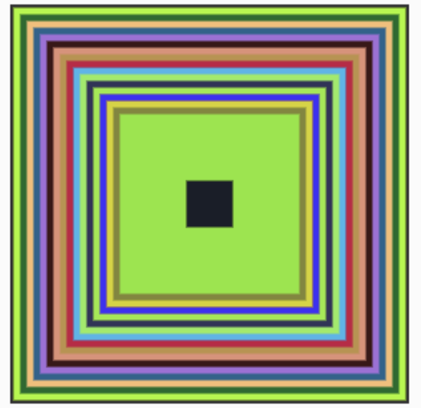
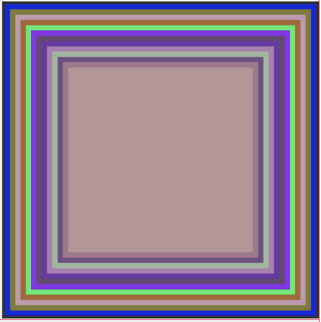

# Quiz 8

## **Part 1: Imaging Technique Inspiration**
1. The Square Fill in Happy Coding, which builds a stack by automatically filling the squares inward at runtime, impressed me. 

2. It removes and flips every stacked square once filled in. I would have to fill Pacita Abad's "Wheels of Fortune" with many dotted circles, but this process is tedious and repetitious. Coding can give a painting life, and we can enhance its visual impact by filling and reversing it like Square Fill. We can fill and invert like Square Fill to enhance the visual effect. The multi-colour rhythm can also satisfy the colour variety of 'Wheels of Fortune'. 

3. 

## **Part 2: Coding Technique Exploration**
1. This coding will use p5.js in JavaScript.

2. Drawing functions are in P5.js. In Square Fill, p5.js loops through the "function draw()" function, drawing a growing square on the canvas and dynamically changing the fill colour. When the square size reaches a threshold, draw a new square and adjust the colour and size parameters to achieve continuous change. When drawing 'Wheels of Fortune,' I could change the square to a circle and resize each circle loop by changing the radius ("radius +="). The circle shrinks and folds inside the larger circle with "maxRadius -=". When the radius is less than zero, reset ("maxRadius = value").  

3. [Link Text](https://happycoding.io/tutorials/p5js/animation/square-fill)
   [Link Text](https://p5js.org/reference/#/p5/draw)

